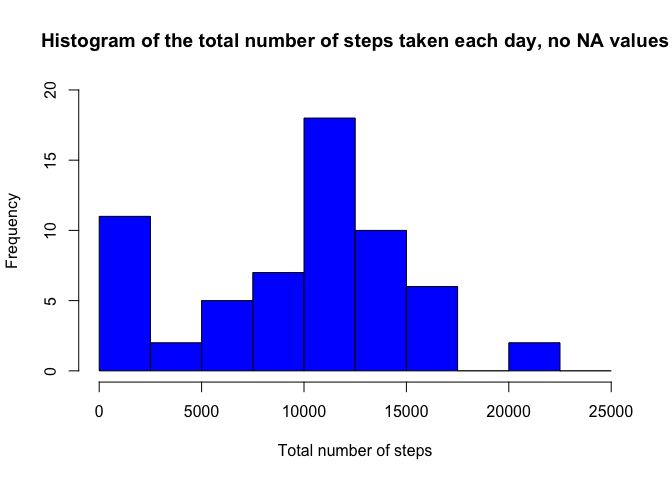
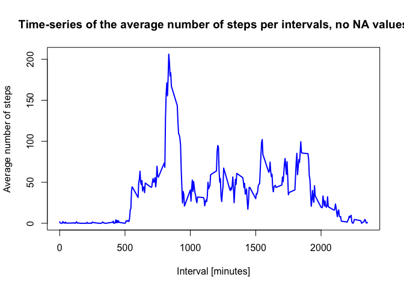
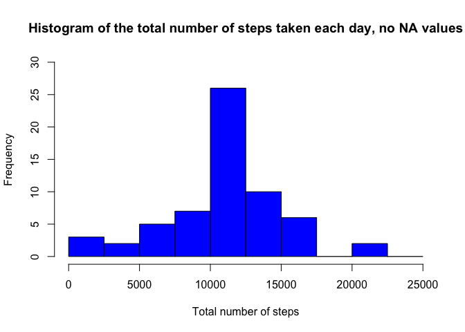
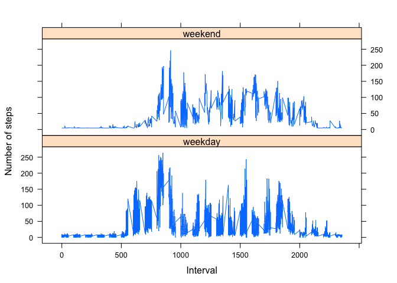

Reproducible Research: Peer Assessment 1
========================================

<h2>
Introduction
</h2>
It is now possible to collect a large amount of data about personal
movement using activity monitoring devices such as a Fitbit, Nike
Fuelband, or Jawbone Up. These type of devices are part of the
“quantified self” movement – a group of enthusiasts who take
measurements about themselves regularly to improve their health, to find
patterns in their behavior, or because they are tech geeks. But these
data remain under-utilized both because the raw data are hard to obtain
and there is a lack of statistical methods and software for processing
and interpreting the data.

This assignment makes use of data from a personal activity monitoring
device. This device collects data at 5 minute intervals through out the
day. The data consists of two months of data from an anonymous
individual collected during the months of October and November, 2012 and
include the number of steps taken in 5 minute intervals each day.

<h2>
Data
</h2>
The data for this assignment can be downloaded from the course web site:

<ul>
<li>
<b>Dataset</b>: Activity monitoring data [52K]
</li>
</ul>
The variables included in this dataset are:

<ul>
<li>
<b>steps</b>: Number of steps taking in a 5-minute interval (missing
values are coded as NA)
</li>
<li>
<b>date</b>: The date on which the measurement data was taken in
YYYY-MM-DD format
</li>
<li>
<b>interval</b>: Identifier for the 5-minute interval in which
measurement was taken
</li>
</ul>
The dataset is stored in a comma-separated-value (CSV) file and there
are a total of 17,568 observations in this dataset.

Assignment This assignment will be described in multiple parts. You will
need to write a report that answers the questions detailed below.
Ultimately, you will need to complete the entire assignment in a
<b>single R markdown document</b> that can be processed by <b>knitr</b>
and be <b>transformed into an HTML file</b>.

Throughout your report make sure you always include the code that you
used to generate the output you present. When writing code chunks in the
R markdown document, always use `echo = TRUE` so that someone else will
be able to read the code. This assignment will be evaluated via peer
assessment so it is essential that your peer evaluators be able to
review the code for your analysis.

For the plotting aspects of this assignment, feel free to use any
plotting system in R (i.e., base, lattice, ggplot2).

<a href="https://github.com/rdpeng/RepData_PeerAssessment1">Fork/clone
the GitHub repository created for this assignment.</a> You will submit
this assignment by pushing your completed files into your forked
repository on GitHub. The assignment submission will consist of the URL
to your GitHub repository and the SHA-1 commit ID for your repository
state.

NOTE: The GitHub repository also contains the dataset for the assignment
so you do not have to download the data separately.

<h3>
PART 1: Loading and processing the data
</h3>
Load necessary packages

    library(knitr)

    ## Warning: package 'knitr' was built under R version 3.2.3

    library(markdown)
    library(rmarkdown)

1a. Load the data (i.e. `read.csv()`)

    # First, we want to load the raw activity data
    unzip(zipfile="activity.zip")
    activity_raw <- read.csv("./activity.csv", stringsAsFactors=FALSE)

1b. Process/transform the data (if necessary) into a format suitable for
your analysis.

    # Convert the date attribute to an actual date format
    activity_raw$date <- as.POSIXct(activity_raw$date, format="%Y-%m-%d")

    # Identify the weekdays from the date attribute
    activity_raw <- data.frame(date=activity_raw$date, 
                               weekday=tolower(weekdays(activity_raw$date)), 
                               steps=activity_raw$steps, 
                               interval=activity_raw$interval)

    # Identify if the day is a weekend or weekday
    activity_raw <- cbind(activity_raw, 
                          daytype=ifelse(activity_raw$weekday == "saturday" | 
                                         activity_raw$weekday == "sunday", "weekend", 
                                         "weekday"))

    # Generate the final data.frame
    activity <- data.frame(date=activity_raw$date, 
                           weekday=activity_raw$weekday, 
                           daytype=activity_raw$daytype, 
                           interval=activity_raw$interval,
                           steps=activity_raw$steps)

Display the first few rows of the `activity` data frame:

    head(activity)

    ##         date weekday daytype interval steps
    ## 1 2012-10-01  monday weekday        0    NA
    ## 2 2012-10-01  monday weekday        5    NA
    ## 3 2012-10-01  monday weekday       10    NA
    ## 4 2012-10-01  monday weekday       15    NA
    ## 5 2012-10-01  monday weekday       20    NA
    ## 6 2012-10-01  monday weekday       25    NA

<h3>
PART 2: What is the mean total number of steps taken per day?
</h3>
For this part of the assignment, you can ignore the missing values in
the dataset.

Make a histogram of the total number of steps taken each day

2a. Calculate the total number of steps per day.

    ## First we compute the total number of steps each day, removing the NA values
    sum_data <- aggregate(activity$steps, by=list(activity$date), FUN=sum, na.rm=TRUE)

    # And then we rename the attributes
    names(sum_data) <- c("date", "total")

2b. Make a histogram of the total number of steps per day.

    # Next, we compute the histogram of the total number of steps each day
    hist(sum_data$total, 
         breaks=seq(from=0, to=25000, by=2500),
         col="blue", 
         xlab="Total number of steps", 
         ylim=c(0, 20), 
         main="Histogram of the total number of steps taken each day, no NA values")

  
 2c. Calculate and report the mean and median of the total number of
steps taken per day.

    ## We use the mean and median functions to calculate these totals.
    mean(sum_data$total)

    ## [1] 9354.23

    median(sum_data$total)

    ## [1] 10395

Result: A mean of 9,354 and a median of 10,395 steps per day.

<h3>
PART 3: What is the average daily activity pattern?
</h3>
3a. Make a time series plot (i.e. `type = "l"`) of the 5-minute interval
(x-axis) and the average number of steps taken, averaged across all days
(y-axis).

    # We will compute the means of steps accross all days for each interval
    mean_data <- aggregate(activity$steps, 
                           by=list(activity$interval), 
                           FUN=mean, 
                           na.rm=TRUE)

    # And then we rename the attributes
    names(mean_data) <- c("interval", "mean")

Display the first few rows of the `mean_data` data frame:

    head(mean_data)

    ##   interval      mean
    ## 1        0 1.7169811
    ## 2        5 0.3396226
    ## 3       10 0.1320755
    ## 4       15 0.1509434
    ## 5       20 0.0754717
    ## 6       25 2.0943396

    # This code will generate the time series plot
    plot(mean_data$interval, 
         mean_data$mean, 
         type="l", 
         col="blue", 
         lwd=2, 
         xlab="Interval [minutes]", 
         ylab="Average number of steps", 
         main="Time-series of the average number of steps per intervals, no NA values")

  
 3b. Which 5-minute interval, on average across all the days in the
dataset, contains the maximum number of steps?

    # Find the position of the maximum mean
    max_pos <- which(mean_data$mean == max(mean_data$mean))

    # Identify the value of interval at this position
    max_interval <- mean_data[max_pos, 1]

<h3>
PART 4: Imputing the missing values
</h3>
Note that there are a number of days/intervals where there are missing
values (coded as `NA`). The presence of missing days may introduce bias
into some calculations or summaries of the data.

4a. Calculate and report the total number of missing values in the
dataset (i.e. the total number of rows with `NA`s).

    # A TRUE boolean value is equivalent to 1 and a FALSE to 0.
    NA_count <- sum(is.na(activity$steps))

Result: There are 2,304 `NA` values.

4b. Devise a strategy for filling in all of the missing values in the
dataset. The strategy does not need to be sophisticated. For example,
you could use the mean/median for that day, or the mean for that
5-minute interval, etc.

    # Identify the NA positions
    na_pos <- which(is.na(activity$steps))

    # Generate a vector of means
    mean_vec <- rep(mean(activity$steps, na.rm=TRUE), times=length(na_pos))

We will then replace each `NA` value with the mean of the steps
attribute.

4c. Create a new dataset that is equal to the original dataset but with
the missing data filled in.

    # Replace the NAs by the means
    activity[na_pos, "steps"] <- mean_vec

    # Display the first few rows of the activity data frame
    head(activity)

    ##         date weekday daytype interval   steps
    ## 1 2012-10-01  monday weekday        0 37.3826
    ## 2 2012-10-01  monday weekday        5 37.3826
    ## 3 2012-10-01  monday weekday       10 37.3826
    ## 4 2012-10-01  monday weekday       15 37.3826
    ## 5 2012-10-01  monday weekday       20 37.3826
    ## 6 2012-10-01  monday weekday       25 37.3826

4d. Make a histogram of the total number of steps taken each day and
calculate and report the mean and median total number of steps taken per
day. Do these values differ from the estimates from the first part of
the assignment? What is the impact of imputing missing data on the
estimates of the total daily number of steps?

    # Calculate the total number of steps each day (NA values removed)
    sum_data <- aggregate(activity$steps, by=list(activity$date), FUN=sum)

    # Rename the attributes
    names(sum_data) <- c("date", "total")

    # Generate the histogram of the total number of steps each day
    hist(sum_data$total, 
         breaks=seq(from=0, to=25000, by=2500),
         col="blue", 
         xlab="Total number of steps", 
         ylim=c(0, 30), 
         main="Histogram of the total number of steps taken each day, no NA values")

  
 Calculate and report the mean and median of the total number of steps
taken per day.

    ## We use the mean and median functions to calculate these totals.
    mean(sum_data$total)

    ## [1] 10766.19

    median(sum_data$total)

    ## [1] 10766.19

Result: A mean of 10,766 and a median of 10,766 steps per day.

Imputing the missing values gives more data to draw from, but I have my
doubts as to whether or not this is giving accurate results.

<h3>
PART 5: Are there differences in activity pattens between weekdays and
weekends?
</h3>
For this part the `weekdays()` function may be of some help here. Use
the dataset with the filled-in missing values for this part.

5a. Create a new factor variable in the dataset with two levels -
“weekdays” and “weekend” indicating whether a given date is a weekday or
weekend day.

    # We already had the variable "daytype" in the activity data frame
    head(activity)

    ##         date weekday daytype interval   steps
    ## 1 2012-10-01  monday weekday        0 37.3826
    ## 2 2012-10-01  monday weekday        5 37.3826
    ## 3 2012-10-01  monday weekday       10 37.3826
    ## 4 2012-10-01  monday weekday       15 37.3826
    ## 5 2012-10-01  monday weekday       20 37.3826
    ## 6 2012-10-01  monday weekday       25 37.3826

5b. Make a panel plot containing a time series plot (i.e. `type = "l"`)
of the 5- minute interval (x-axis) and the average number of steps
taken, averaged across all weekday days or weekend days (y-axis).

    # This process will require the lattice graphical library
    library(lattice)

    # Calculate the average number of steps taken, averaged across all daytype variables
    mean_data <- aggregate(activity$steps, 
                           by=list(activity$daytype, 
                                   activity$weekday, activity$interval), mean)

    # Rename the attributes
    names(mean_data) <- c("daytype", "weekday", "interval", "mean")

    # Display the first few rows of the mean_data data frame
    head(mean_data)

    ##   daytype  weekday interval     mean
    ## 1 weekday   friday        0 8.307244
    ## 2 weekday   monday        0 9.418355
    ## 3 weekend saturday        0 4.672825
    ## 4 weekend   sunday        0 4.672825
    ## 5 weekday thursday        0 9.375844
    ## 6 weekday  tuesday        0 0.000000

Generate the panel plot.

    # Generate the panel plot
    xyplot(mean ~ interval | daytype, mean_data, 
           type="l", 
           lwd=1, 
           xlab="Interval", 
           ylab="Number of steps", 
           layout=c(1,2))

  
knit2html()
